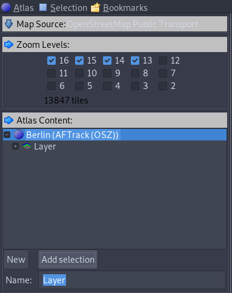

# MOBAC Usage Guide

## 1. Create a new OSZ Atlas

On the left top click `Atlas`, then enter a name (probably the name
of the city is a good idea) and select the atlas format `AFTrack (OSZ)`.

## 2. Find your City

Zoom out of the map and use the `Right Click-Drag` of your mouse
to have your city in view. Don't select anything with the `Left Click`
yet.

## 3. Select your City

Now use the `Left Click` and hold the mouse button in order to select
a rectangle around your city. This will lead to two things: a red line
marking your selection and a half-transparent tile-based selection
which is the actual map atlas that will be downloaded.

Afterwards go to the `Zoom Levels` section and select at least the
zoom levels `16` and `15`. The higher the zoom levels, the more detailed
they are. Level `16` is with street names, whereas level `15` has a better
overview of finding out where exactly you are and contains only major
highway and main street names.

## 4. Add Selection

When you have selected everything, go to the `Atlas Content` section
and click the `Add Selection` button. Before you do, make sure the
`Name` field contains the defaulted `Layer` as a value.

## 5. Download Atlas

Now you can click the `Create Atlas` button on the bottom of the sidebar.
This will lead to the actual download and creation of the map atlas and
might take a while depending on your internet connection bandwidth.

## 6. Extract Atlas

When the download is completed, click on the `Open Atlas Folder` button.
This will lead you to the folder containing another folder with the map
name you entered in step `#1` as a prefix. It will probably be named
something like `Mapname_Year-Month-Day_TimeInMinutes`.

Inside this folder you will find the `Layer.osz` file. Now right click
on it and extract it.

Inside the extracted folder, you will now have a `Manifest.txt` file
and folders representing the different `Zoom Levels` you selected earlier.

## 7. Import Atlas

Now go to the `/path/to/infiltrator/map` folder, create a folder with
the same name as your previous map name (in my case `Berlin`), and copy
mentioned `Manifest.txt` and `Zoom Level` folders into it.

